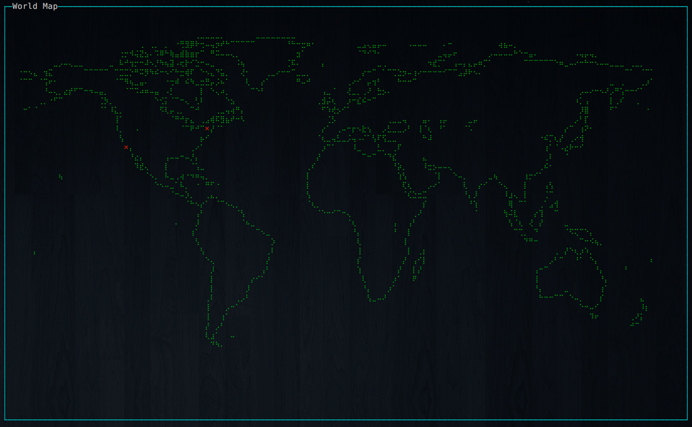

# map-coords

> Plot coordinates on a world map.

# Install

```bash
$ npm install -g map-coords
```

# Examples

`coords.csv`

```csv
40.730610,-73.935242
34.052235,-118.243683
```

```bash
$ map-coords coords.csv
```

```bash
$ cat coords.csv | map-coords
```

```bash
$ echo 40.730610,-73.935242 34.052235,-118.243683 | map-coords
```

Output



# License

MIT
